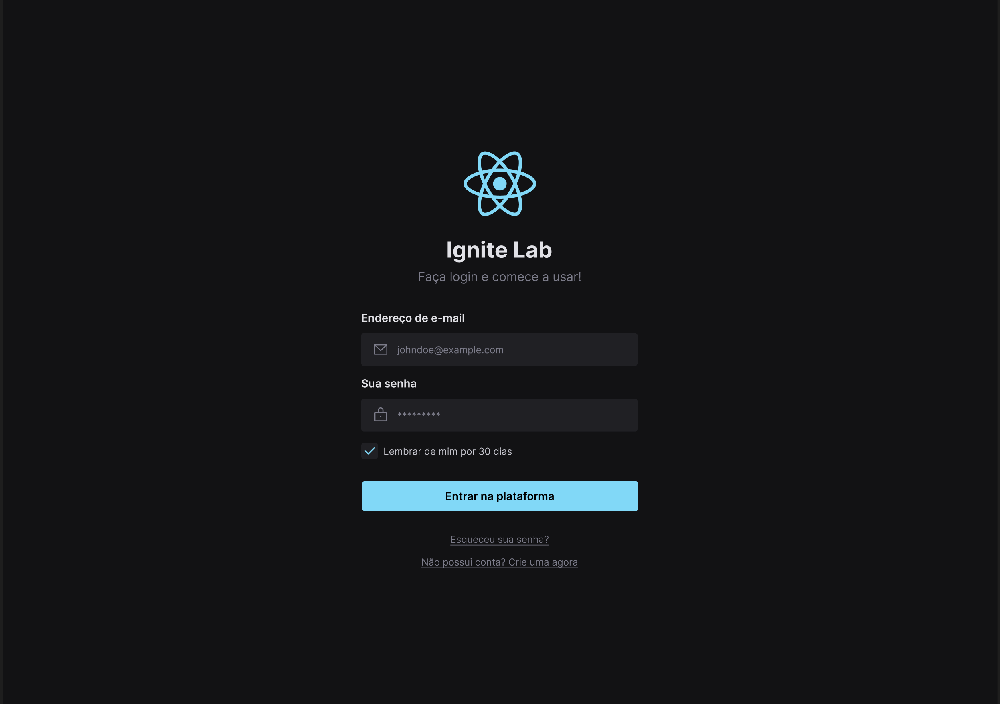

  

  <a href="#-tecnologias">Tecnologias</a>&nbsp;&nbsp;&nbsp;|&nbsp;&nbsp;&nbsp;
  <a href="#-layout">Layout</a>&nbsp;&nbsp;&nbsp;|&nbsp;&nbsp;&nbsp;
  <a href="#-storybook">Storybook</a>&nbsp;&nbsp;&nbsp;|&nbsp;&nbsp;&nbsp;
  <a href="#memo-licença">Licença</a>

# Ignite Lab - Design System

## 🚀 Tecnologias

### Front-end
- HTML
- CSS
- JavaScript
- TypeScript
- ReactJS
- Tailwind CSS
- Radix UI
- Storybook
- A11y
- Jest
- Testing Library
- Mock Service Worker (MSW)

## 🎨 Layout:

Figma: https://www.figma.com/file/y52uBE3FiYwIGawfCpVkkj/Ignite-Lab-Design-System?node-id=0%3A1

## 🎨 Storybook:

Preview: https://joaod3v.github.io/ignite-lab-design-system

## :memo: Licença

Esse projeto está sob a licença MIT. Veja o arquivo [LICENSE](LICENSE) para mais detalhes.

---

Feito com ♥ by joaoD3V
